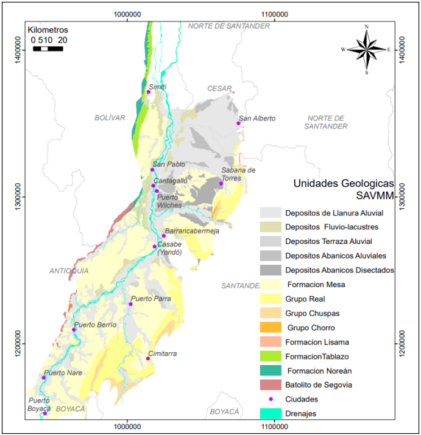

# Análisis hidrogeoquímico-multivariado del agua subterránea en la zona de Puerto Wilches

## Resumen

En este documento se presenta un análisis multivariado del agua subterránea en la zona del municipio de Puerto Wilches, con el objetivo de identificar la composición química del recurso hídrico subterráneo del Sistema Acuífero localizado en este municipio.
Para lo anterior, se realizó la compilación y análisis de 43 muestras con datos de calidad de agua subterránea localizadas en la zona de interés, mediante el uso de estadística descriptiva, revisión de la calidad de los datos (balance iónico), análisis de componentes principales, agrupamiento jerárquico (dendograma), y generación de diagramas de Pipper, Stiff, Gibbs y Schoeller.

De acuerdo con el análisis del diagrama de Piper se observó que. 

Con el ACP, se determinaron tres componentes principales que representan el 59.4% de la variabilidad de los datos y con el AAJ se obtuvieron 6 grupos que representan las 140 caracterizaciones fisicoquímicas. 

Se identificaron XXX procesos geoquímicos principales que determinan la química del agua subterránea en Puerto Wilches: 1) Recarga - infiltración de agua meteórica, 2) Disolución - interacción del agua con silicatos y carbonatos 3) Alteración Antropogénica – contaminación por el desarrollo de actividades industriales realizadas en el área de estudio.

En cuanto al comportamiento espacial, se generaron las isolineas del parámetro de sólidos disueltos totales SDT, donde XXXXXXX

Palabras clave: Hidrogeoquímica, Calidad de agua, Puerto Wilches, análisis de componentes principales.

## Introducción

De acuerdo con el Ministerio de Ambiente y Desarrollo Sostenible: “Las aguas subterráneas son la mayor reserva de agua “dulce” en las regiones habitadas por los seres humanos, representan más del 95% del total de las aguas disponibles de todos los continentes e islas y son esenciales para mantener el caudal de base de muchos ríos y la humedad del suelo en las riberas y áreas bajas de las cuencas” (MADS, 2019). Razón por la cual es de gran importancia conocer los aspectos relacionados con su calidad y con los procesos geológicos que allí ocurren con el fin de tomar las decisiones necesarias para su protección.
La calidad del agua subterránea abarca distintos parámetros que varían espacial y temporalmente, de acuerdo con las propiedades fisicoquímicas de las rocas, lo cual brinda unas condiciones ambientales para el agua subterránea, las cuales son esenciales para comprender los procesos geoquímicos que controlan la composición química del agua subterránea de la zona de estudio.

Teniendo en cuenta lo anterior, para la interpretación de los parámetros presentes en el agua subterránea, es necesario contar con métodos de análisis que permitan evaluar, de manera simultánea, las relaciones que existen entre parámetros y su evolución espacial y temporal, como lo hacen los métodos estadísticos multivariados. (Gómez Ingry & Mesa Gustavo, 2016).

Dentro de los métodos más utilizados en el análisis estadístico multivariado (AEM) se encuentran: el Análisis de Componentes Principales (ACP), que corresponde a una técnica estadística utilizada para descifrar patrones dentro de grandes conjuntos de datos y el Análisis de Agrupamiento Jerárquico (AAJ) permite identificar firmas químicas similares entre las muestras y así agruparlas en grupos denominados clústers (Malagón et al., 2021).
Por otra parte, existen técnicas gráficas que facilitan el entendimiento del comportamiento geoquímico de las aguas subterráneas, como es el caso de los diagramas de Pipper, Stiff, Gibbs, y Schoeller, los cuales permiten determinar las diferencias y similitudes entre las distintas muestras para así clasificarlas en grupos mayoritarios de agua presentes en el acuífero y los factores que influencian la calidad del agua.

En cuanto al área de estudio, el municipio de Puerto Wilches se localiza en el Sistema Acuífero del Valle Medio del Magdalena, el cual se encuentra ubicado en la cuenca hidrográfica del Magdalena, Cauca, donde se registra el mayor consumo de agua subterránea en el país (Malagón et al., 2021).
En el presente documento se busca analizar la composición química del agua subterránea en el municipio de Puerto Wilches, con el fin de comprender los procesos geoquímicos que allí se presentan.

## Zona de estudio

El municipio de Puerto Wilches se encuentra localizado en el departamento de Santander en el Valle Medio del Magdalena, donde el río Magdalena es el eje principal hidrgráfico.

El área de estudio se caracteriza por presentar un paisaje donde la mayor parte del territorio es plano con algunas ondulaciones, terrazas, pantanos y ciénagas.
En cuanto a la geología de la zona, de acuerdo con (Malagón et al, 2021), el Sistema Acuífero Valle Medio del Magdalena comprende unidades sedimentarias relacionadas con diferentes procesos geológicos desarrollados entre el Jurásico y el Cuaternario reciente, donde las unidades principales localizadas en el municipio de Puerto Wilches son las siguientes:

### Grupo Real

Grupo Real está formado por capas gruesas de areniscas conglomeráticas, con fragmentos de guijos finos a medios, con estratificación cruzada, intercaladas con capas medias a gruesas de areniscas cuarzosas tabulares con matriz arcillosa y lodolitas silíceas friables de color gris claro (N7) y púrpura grisáceo (Gómez et al., 2008). Una de las características que presenta el Grupo Real es la presencia de abundante hornblenda y magnetita en varios de los niveles de areniscas, esta abundancia de hornblenda estaría relacionada con la actividad volcánica de la Cordillera Central que se iniciaría con el Mioceno. En la parte superior del Grupo Real se encuentran depósitos epiclásticos, los cuales han sido relacionados con el vulcanismo andesítico del Valle del Cauca (MINMINAS – SERVICIO GEOLÓGICO COLOMBIANO, 2012).

### Depósitos de terrazas aluviales 

Esta unidad se encuentra conformada por diferentes depósitos de origen fluvial. En algunas localidades predominan arenas líticas y capas gruesas canaliformes de conglomerados clastosoportados, polimícticos, angulares a subredondeados. Estos depósitos presentan una composición limo-arcillosa en la parte superior y de intercalaciones de gravas, arenas gruesas y limos hacia la base, depositados en un ambiente fluvial. El espesor máximo de 40 m sobreyace en la Formación Mesa, depósitos de abanicos y coluviales recientes. (Malagón et al., 2021).

### Depósitos fluvio – lacustres 

En el área de estudio se distinguen sedimentos fluvio – lacustres, depósitos de llanura de inundación y de planicie fluvio – lacustre. La característica estratigráfica principal de este tipo de depósitos es de facies de sedimentos finos de arena y lodos con altos contenidos de materia orgánica

## Materiales y Métodos

Se analizaron 43 muestras, donde se monitorearon 15 parámetros: Conductividad Eléctrica, (CE), Temperatura, Sólidos Disueltos Totales (SDT), pH, Silice (SiO2), Calcio (Ca2+), Sodio (Na+), Potasio (K+), Magnesio (Mg2+), Hierro (Fe), Cloruros (Cl-), Sulfatos (SO42), Bicarbonatos (HCO3-) y Nitritos (NO)2, Nitratos (NO3-).

En cuanto a la calidad de los datos se calculó el valor de error analítico del balance iónico, donde la suma de la concentración en miliequivalentes de cationes debe ser igual a la suma de las concentraciones en miliequivalentes de aniones.

Respecto, al análisis de los datos, este se realizó utilizando estadística descriptiva y análisis multivariado: Análisis de Componentes Principales y Análisis de agrupamiento jerarquico (ACP y AAJ), usando las librerías “factoextra” y “FactoMineR” del paquete estadístico R. 

Finalmente, para la generación de los diagramas de Pipper, Stiff, Gibbs, y Schoeller se utilizó la librería WQChartPy del lenguaje de programación Python.
Para la representación de isolíneas del parámetro SDT, se utilizó el método de interpolación Kriging.

## Resultados

### Calidad de los datos

A continuación, se presenta la localización de las muestras de agua subterránea en el municipio de Puerto Wilches.

Inicialmente, se revisó la completitud de los datos de los parámetros en las 43 muestras, donde se identificó que la información está completa en todos los parámetros, salvo en el parámetro de temperatura, donde se utilizó el valor de temperatura promedio para las muestras que no contaban con este dato.

Posterior a esto se calculó el valor de error analítico del balance iónico, usando la siguiente ecuación:

Para esto se calculó la concentración de cada catión y anión en miliequivalentes.
De acuerdo con (Malagón et al, 2021) un error analítico del balance iónico menor o igual al +/- el 10% se considera aceptable. 
Teniendo en cuenta lo anterior, se eliminaron 10 muestras donde el error análitico del balance iónico era superior al 10%, por lo tanto, solamente se realizarán los análisis estadísticos para 33 muestras. La ubicación y tipo de las muestras seleccionadas se presenta en la siguiente figura

### Estadística de los datos

Una vez realizada la selección de las muestras, por medio del cálculo del error analítico del balance iónico, se estimaron las medidas de tendencia central y dispersión, para cada parámetro monitoreado, como se muestra en la tabla a continuación

|         |       CE|        P|       T|      pH|    Mg2+|    Ca.2|     Na.|      K.|    Fe2.|    HCO3.|     Cl.|   SO4.2|    NO3.|    NO2.|      SDT|      SST|     SSV|       ST|
|:--------|--------:|--------:|-------:|-------:|-------:|-------:|-------:|-------:|-------:|--------:|-------:|-------:|-------:|-------:|--------:|--------:|-------:|--------:|
|Min.     |   4.1400|   3.0000| 27.5900|  4.1200|  0.5000|  0.5000|  0.6000|  0.1300|  0.0500|   0.0000|  0.1000|  0.0500|  0.0500|  0.0500|  19.0000|   2.5000|  2.5000|  27.0000|
|1st Qu.  |  73.7000|  10.5000| 28.6600|  6.0900|  2.0000|  6.0000|  4.8500|  1.5560|  0.1000|  25.0000|  0.3000|  0.3000|  0.0750|  0.0500|  78.5000|   2.5000|  2.5000|  99.5000|
|Median   | 144.1000|  64.0000| 29.0000|  6.7300|  4.0000|  9.0000|  8.1000|  2.7000|  0.1000|  63.0000|  1.4000|  0.5000|  0.1000|  0.1000| 155.0000|   5.0000|  5.0000| 155.0000|
|Mean     | 160.5000|  76.7100| 28.9900|  6.5540|  3.8230| 11.6900|  9.8020|  2.6560|  0.2678|  65.0200|  2.7240|  1.4590|  2.9350|  0.0758| 142.0000|   9.5000|  4.0970| 149.0000|
|3rd Qu.  | 224.5000|  80.0000| 29.0000|  7.0650|  5.0000| 13.0000| 10.5000|  3.8500|  0.4164|  87.5000|  3.4000|  1.2500|  3.0500|  0.1000| 184.0000|   6.0000|  5.0000| 191.0000|
|Max.     | 380.0000| 365.0000| 33.0000|  8.3300|  8.0000| 62.0000| 42.2100|  5.6000|  0.9000| 216.0000| 20.6000| 16.9000| 35.7000|  0.1000| 290.0000| 109.0000| 12.0000| 301.0000|
|IQR      | 150.8000|  69.5000|  0.3450|  0.9750|  3.0000|  7.0000|  5.6500|  2.2935|  0.3164|  62.5000|  3.1000|  0.9500|  2.9750|  0.0500| 105.5000|   3.5000|  2.5000|  91.5000|
|sd       |  99.2695|  95.3559|  0.9661|  1.0306|  2.3472| 11.8284|  9.6124|  1.4506|  0.2602|  46.7195|  4.2624|  3.0509|  6.8090|  0.0254|  68.8058|  19.4066|  1.9254|  67.7003|
|cv       |   0.6183|   1.2431|  0.0333|  0.1573|  0.6140|  1.0115|  0.9806|  0.5461|  0.9715|   0.7186|  1.5649|  2.0906|  2.3195|  0.3351|   0.4847|   2.0428|  0.4700|   0.4544|
|Skewness |   0.3590|   2.0576|  2.3484| -0.6562|  0.4372|  2.5780|  2.3174|  0.0704|  1.0669|   0.8556|  2.7547|  4.2060|  3.6583| -0.0615|  -0.0482|   4.4017|  2.0268|   0.1397|
|Kurtosis |  -0.8963|   3.4215|  7.5749|  0.1403| -1.0473|  8.0211|  5.1530| -1.0370| -0.2548|   1.3157|  7.9583| 18.2331| 14.4358| -2.0596|  -0.7051|  19.3935|  6.3969|  -0.4370|
|NA's     |   0.0000|   0.0000|  0.0000|  0.0000|  0.0000|  0.0000|  0.0000|  0.0000|  0.0000|   0.0000|  0.0000|  0.0000|  0.0000|  0.0000|   0.0000|   0.0000|  0.0000|   0.0000|
|n        |  31.0000|  31.0000| 31.0000| 31.0000| 31.0000| 31.0000| 31.0000| 31.0000| 31.0000|  31.0000| 31.0000| 31.0000| 31.0000| 31.0000|  31.0000|  31.0000| 31.0000|  31.0000|

## Bibliografía

* (18) (PDF) Revisión de los métodos estadísticos multivariados usados en el análisis de calidad de aguas. Available from: https://www.researchgate.net/publication/305670545_Revision_de_los_metodos_estadisticos_multivariados_usados_en_el_analisis_de_calidad_de_aguas [accessed May 13 2022].

